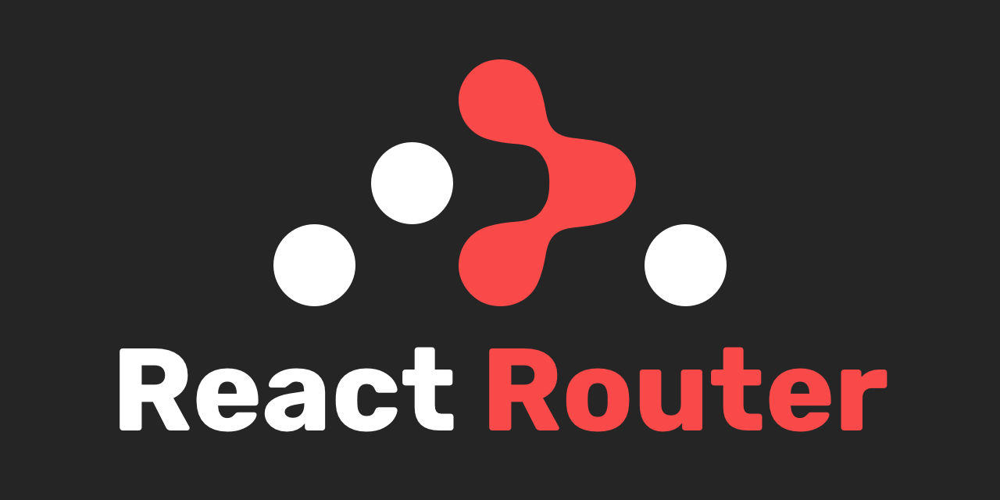

# Projeto de Rotas com React Router DOM

 

Este projeto demonstra a criação e integração de rotas no React utilizando o React Router DOM. Nele, você encontrará como configurar rotas, entender o conceito de navegação em uma aplicação de página única (SPA) e ver exemplos de uso dos componentes `Link` e `NavLink`.

## Índice
1. [Introdução ao React Router DOM](#introdução-ao-react-router-dom)
2. [Componentes Principais](#componentes-principais)
   - Link e NavLink
   - createBrowserRouter e RouterProvider
3. [Criando Rotas](#criando-rotas)
4. [Exemplo de Configuração de Rota](#exemplo-de-configuração-de-rota)
5. [Como Executar o Projeto](#como-executar-o-projeto)
6. [Conclusão](#conclusão)

---

## Introdução ao React Router DOM

O **React Router DOM** é uma biblioteca popular para gerenciar rotas em aplicativos React, especialmente aqueles que são desenvolvidos como SPAs (Single Page Applications). Em uma SPA, não há necessidade de carregar uma nova página do servidor cada vez que um link é clicado. Em vez disso, o React Router DOM manipula a navegação entre "páginas" ou "componentes de rota" diretamente no navegador, criando uma experiência mais rápida e fluida para o usuário.

## Componentes Principais

### Link e NavLink

- **Link**: Esse componente é usado para navegação entre páginas dentro da aplicação sem recarregar a página. Ele evita a recarga completa do navegador, permitindo uma experiência de usuário mais rápida.
  
  ```javascript
  <Link to="/pagina-a">Ir para Página A</Link>
  ```

- **NavLink**: Similar ao `Link`, mas oferece uma maneira de estilizar links de navegação com base no estado ativo da rota. É ideal para menus de navegação onde você deseja destacar a página ativa.
  
  ```javascript
  <NavLink to="/pagina-a" activeClassName="ativo">Página A</NavLink>
  ```

### createBrowserRouter e RouterProvider

- **createBrowserRouter**: Função recomendada pelo próprio React Router para criar o roteador. Ele é ideal para navegação de SPA, usando o histórico do navegador para manipular as rotas.
  
- **RouterProvider**: Um componente que recebe o roteador configurado e o fornece para a aplicação inteira, facilitando o uso do roteador em qualquer componente.

## Criando Rotas

Para configurar uma rota no React, o React Router DOM trata cada rota como um **componente**. Isso significa que, ao definir rotas, estamos basicamente criando componentes que representam cada página ou seção de nossa aplicação.

### Exemplo de Configuração de Rota

Abaixo, mostramos como configurar rotas com `createBrowserRouter` e `RouterProvider` para criar uma navegação fluida em uma SPA:

```javascript
// router.js
import { createBrowserRouter } from "react-router-dom";
import PaginaA from "../pages/pagina-a";


const router = createBrowserRouter([
  {
    path: "/",
    errorElement: <ErrorNotFound />,
    element: <Layout />,
    children: [
      {
        path: "/",
        element: <PaginaA />
      }
    ],
  },
]);

export default router;
```

Neste exemplo:
- `path`: Define a URL que a rota corresponderá.
- `element`: O componente que será exibido quando a URL corresponder ao `path`.
- `children`: Uma lista de rotas aninhadas que também podem ser acessadas a partir do caminho principal.
- `errorElement`: Componente exibido em caso de erro (ex: rota não encontrada).

### Integrando o Roteador ao Projeto

Para usar o roteador, basta importá-lo e colocá-lo dentro do `RouterProvider`:

```javascript
// App.js
import { RouterProvider } from "react-router-dom";
import router from "./router/router";

function App() {
  return (
    <RouterProvider router={router} />
  );
}

export default App;
```

Essa configuração permite que o roteador esteja disponível em todo o aplicativo, facilitando a navegação entre as diferentes páginas e componentes.

## Como Executar o Projeto

1. Clone o repositório.
2. Instale as dependências:
   ```bash
   npm install
   ```
3. Inicie o servidor de desenvolvimento:
   ```bash
   npm run dev
   ```
4. Abra o navegador e acesse `http://localhost:5173` para ver o projeto em execução.

## Conclusão

Com o React Router DOM, criar e gerenciar rotas em uma SPA fica simples e intuitivo. O uso de `Link`, `NavLink`, `createBrowserRouter` e `RouterProvider` permite que você organize sua navegação e forneça uma experiência de usuário mais fluida. Além disso, as rotas podem ser facilmente configuradas e atualizadas, tornando o gerenciamento de navegação em aplicações complexas algo prático e eficiente.


<a href="https://skillicons.dev">
  
</a>