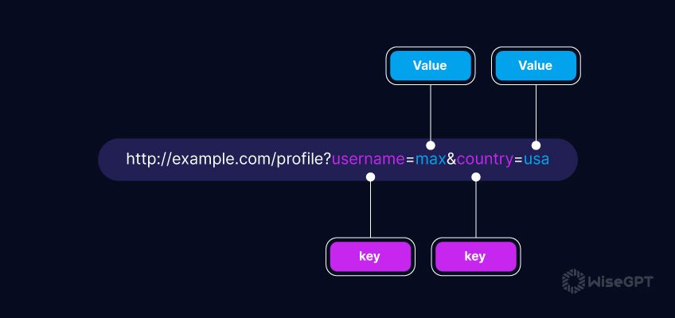

# Rotas com React Router DOM


## Índice

1. [Introdução a rotas](#introdução-a-rotas)
   - [React Router Dom](#introdução-ao-react-router-dom)
2. [Componentes Principais](#componentes-principais)
   - [createBrowserRouter e RouterProvider](#createbrowserrouter-e-routerprovider)
3. [Criando Rotas](#criando-rotas)
   - [Exemplo de Configuração de Rota](#exemplo-de-configuração-de-rota)
   - [Integrando o Roteador ao Projeto](#integrando-o-roteador-ao-projeto)
   - [Link e NavLink](#link-e-navlink)
4. [Query Parameters](#query-parameters)
   - [O que são Query Parameters?](#o-que-são-query-parameters)
   - [Criando um Query Parameters](#criando-um-query-parameters)
   - [Navegando com Query Parameters](#navegando-com-query-parameters)
5. [Route Parameters](#route-parameters)
   - [O que são Route Parameters?](#o-que-são-route-parameters)
   - [Estrutura de um Route Parameter](#exemplo-de-uso-com-route-parameters)
   - [Exemplo de Uso com Route Parameters](#exemplo-de-uso-com-route-parameters)
6. [Como Executar o Projeto](#como-executar-o-projeto)


## Introdução a rotas

O React, por si só, não oferece uma solução de roteamento nativa. Para implementar navegação entre diferentes páginas, é necessário usar bibliotecas de terceiros. Essas bibliotecas facilitam a criação de uma experiência de navegação, permitindo que os usuários mudem de visualização sem recarregar a página. Algumas das bibliotecas mais populares para roteamento em React são `TanStack Router`, e `React Router Dom`.

### Introdução ao React Router DOM

O **React Router DOM** é uma biblioteca popular para gerenciar rotas em aplicativos React, especialmente desenvolvidos como SPAs (Single Page Applications). Em uma SPA, não há necessidade de carregar uma nova página do servidor cada vez que um link é clicado; o React Router DOM manipula a navegação entre "páginas" ou "componentes de rota" diretamente no navegador, criando uma experiência mais rápida e fluida para o usuário.

## Componentes Principais

### createBrowserRouter e RouterProvider

- **createBrowserRouter**: Função recomendada pelo React Router para criar um roteador, ideal para navegação de SPA, utilizando o histórico do navegador para gerenciar rotas.
- **RouterProvider**: Componente que recebe o roteador configurado e o fornece para a aplicação inteira, facilitando o uso do roteador em qualquer componente.

## Criando Rotas

No React Router DOM, cada rota é tratada como um **componente**. Ao definir rotas, você cria componentes que representam cada página ou seção da aplicação.

### Exemplo de Configuração de Rota

Abaixo está um exemplo de como configurar rotas com `createBrowserRouter` e `RouterProvider` para criar uma navegação em uma SPA:

```jsx
// router.jsx
import { createBrowserRouter } from "react-router-dom";
import PaginaA from "../pages/pagina-a";
import Params from "../pages/params";

const router = createBrowserRouter([
  {
    path: "/",
    errorElement: <ErrorNotFound />,
    element: <Layout />,
    children: [
      {
        path: "/",
        element: <PaginaA />,
      },
    ],
  },
]);

export default router;
```

Neste exemplo:

- `path`: Define a URL correspondente à rota.
- `element`: O componente exibido quando a URL corresponder ao `path`.
- `children`: Lista de rotas aninhadas acessíveis a partir do caminho principal.
- `errorElement`: Componente exibido em caso de erro (ex: rota não encontrada).

### Integrando o Roteador ao Projeto

Para usar o roteador, importe-o e coloque-o dentro do `RouterProvider`:

```jsx
// App.jsx
import { RouterProvider } from "react-router-dom";
import router from "./router/router";

function App() {
  return <RouterProvider router={router} />;
}

export default App;
```

### Link e NavLink

- **Link**: Usado para navegação entre páginas na aplicação sem recarregar a página. Isso evita a recarga completa do navegador.

```jsx
<Link to="/pagina-a">Ir para Página A</Link>
```

- **NavLink**: Semelhante ao `Link`, mas oferece uma maneira de estilizar links de navegação com base no estado ativo da rota, ideal para menus de navegação que destacam a página ativa.

```jsx
<NavLink
  to={link.to}
  className={({ isActive }) =>
    isActive
      ? "bg-blue-700 text-white rounded-lg"
      : "hover:bg-gray-100 hover:text-gray-900 rounded-lg"
  }
>
  Página a
</NavLink>
```

## Query Parameters

### O que são Query Parameters?

**Query parameters** são partes de uma URL que aparecem após o `?` e são utilizados para enviar informações adicionais. Por exemplo, filtrar, buscar ou fornecer dados dinâmicos sem alterar a estrutura da URL.

### Criando um Query Parameters

```jsx
// router.jsx
import { createBrowserRouter } from "react-router-dom";
import PaginaA from "../pages/pagina-a";
import Params from "../pages/params";
import QueryParams from "../pages/query-params";

const router = createBrowserRouter([
  {
    path: "/",
    errorElement: <ErrorNotFound />,
    element: <Layout />,
    children: [
      {...}, // Outras rotas
       {
        path: "/search",
        element: <QueryParams/>
      }
    ],
  },
]);

export default router;
```

A URL terá o seguinte formato: `http://localhost:5173/search?q=react`, onde `q=react` é um parâmetro de consulta. Neste caso, `q` é a chave e `react` é o valor associado a essa chave. Para acessar parâmetros de consulta no React Router Dom, você pode utilizar o hook `useLocation` em conjunto com `URLSearchParams`, que permite analisar e extrair facilmente os valores dos parâmetros.



```jsx
// query-params.jsx
import { useLocation } from "react-router-dom";

export default function QueryParams() {
  const location = useLocation();
  const searchParams = new URLSearchParams(location.search);
  const query = searchParams.get("q");

  return (
    <div>
      <p>Resultados da busca para: {query}</p>
    </div>
  );
}
```

### Navegando com Query Parameters

Para navegar com query parameters, basta adicionar `chave` e `valor` dentro do link

```jsx
// search-page.jsx
import { Link } from "react-router-dom";

export default function SearchPage() {
  return (
    <Link
      to={`/query-params?q=react`}
      className="mt-4 inline-block px-4 py-2 bg-blue-500 text-white rounded-md hover:bg-blue-600 transition"
    >
      Buscar por "react"
    </Link>
  );
}
```

## Route Parameters

### O que são Route Parameters?

**Route parameters** são partes dinâmicas da URL que permitem que você passe valores específicos na rota. Eles são definidos na URL com um prefixo `:` e podem ser utilizados para identificar recursos únicos, como usuários, posts ou produtos.

### Criando Route Parameters

```jsx
// router.jsx
import { createBrowserRouter } from "react-router-dom";
import PaginaA from "../pages/pagina-a";
import Params from "../pages/params";
import QueryParams from "../pages/query-params";
import Layout from "../components/Layout";
import ErrorNotFound from "../components/ErrorNotFound";

const router = createBrowserRouter([
  {
    path: "/",
    errorElement: <ErrorNotFound />,
    element: <Layout />,
    children: [
      {...}, // Outras rotas
      {
        path: "/params/:pokemonId",
        element: <Params />
      },
    ],
  },
]);

export default router;
```

No exemplo acima, a URL `http://localhost:5173/params/123` contém um **Route Parameter**. O `:pokemonId` representa um parâmetro dinâmico na rota, onde `123` é o valor específico que pode corresponder a um ID de usuário, um ID de produto, um slug, entre outros.

### Estrutura de um Route Parameter

A estrutura de um Route Parameter no React Router é definida da seguinte maneira:

- **Prefixo de dois pontos (`:`)**: Indica que o segmento é um parâmetro dinâmico.
- **Nome do parâmetro**: Este é o nome que você usará para acessar o valor desse parâmetro dentro do componente correspondente. No exemplo, `pokemonId` é o nome do parâmetro.

```js
{
  path: "/params/:pokemonId/:productId",
  element: <Params />
},
```

### Exemplo de Uso com Route Parameters

Abaixo está um exemplo simples que demonstra como usar route parameters para exibir detalhes de um post:

```jsx
// Params.jsx
import { useParams } from "react-router-dom";

export default function Params() {
  const { pokemonId } = useParams();

  return (
    <div className="min-h-screen bg-zinc-800 flex items-center justify-center px-4">
      <h1>ID do pokemon: {pokemonId}</h1>
    </div>
  );
}
```

## Como Executar o Projeto

1. Clone o repositório.
2. Instale as dependências:
   ```bash
   npm install
   ```
3. Inicie o servidor de desenvolvimento:
   ```bash
   npm run dev
   ```
4. Abra o navegador e acesse `http://localhost:5173` para ver o projeto em execução.


<a href="https://skillicons.dev">
  
</a>
